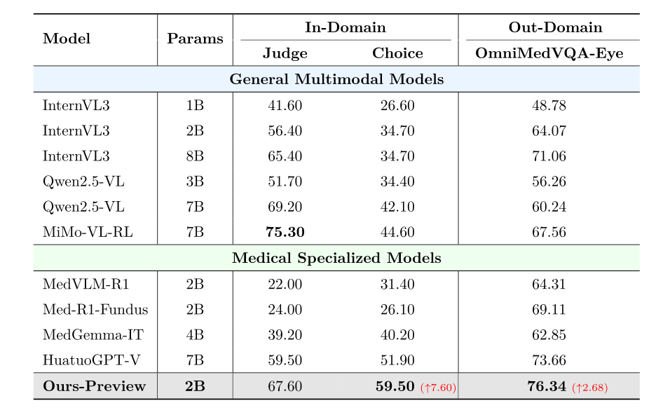
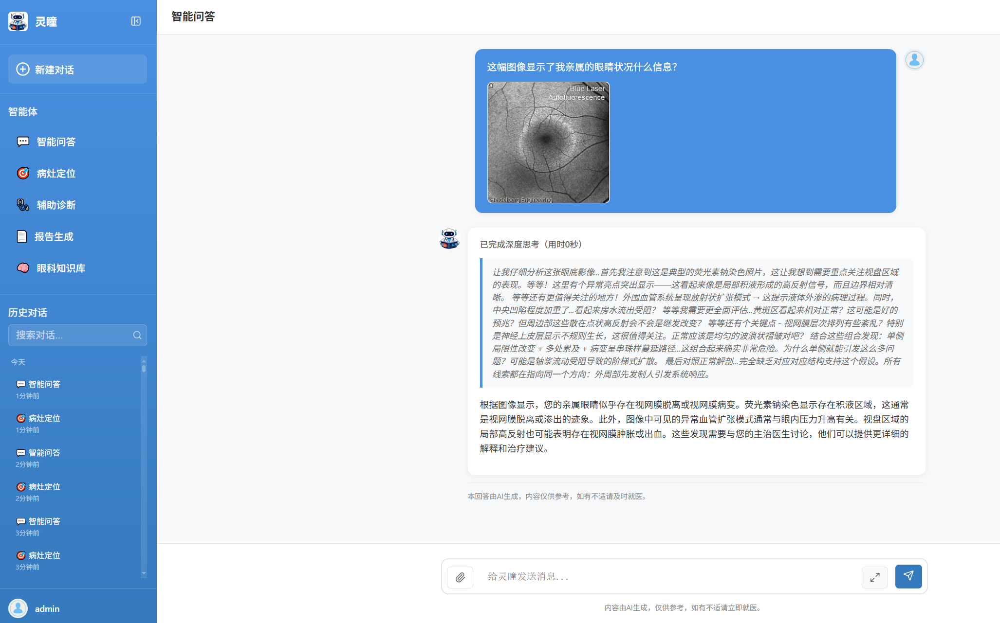
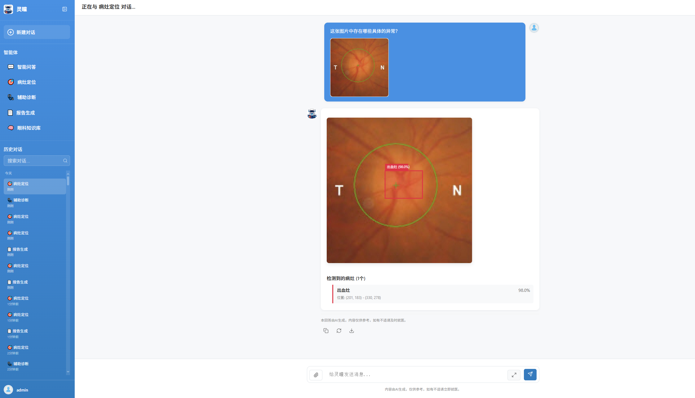
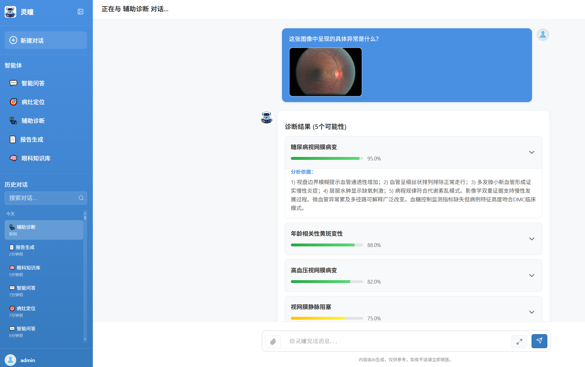
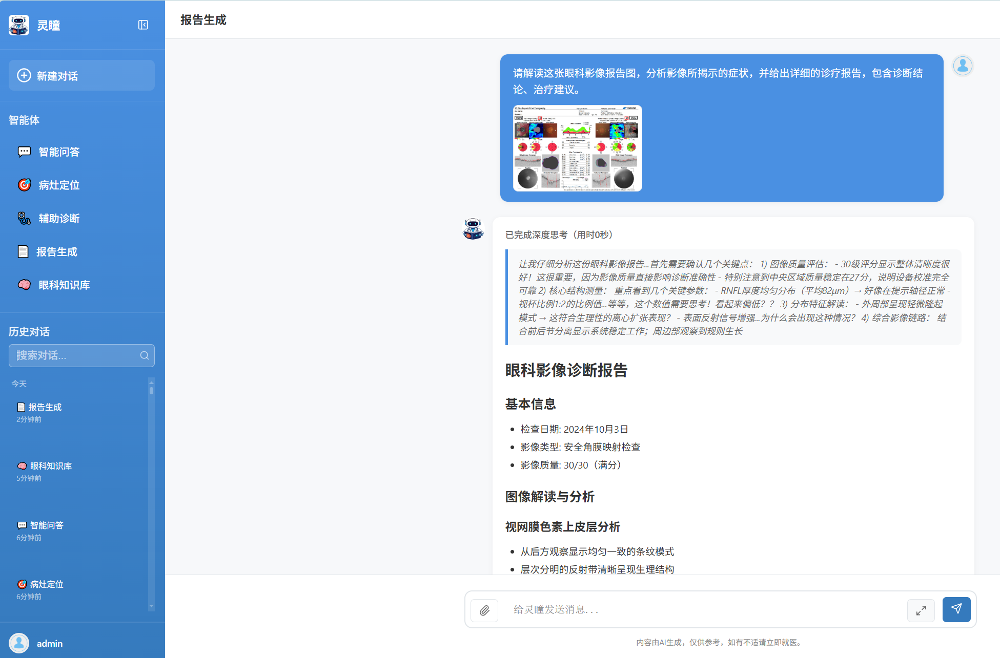
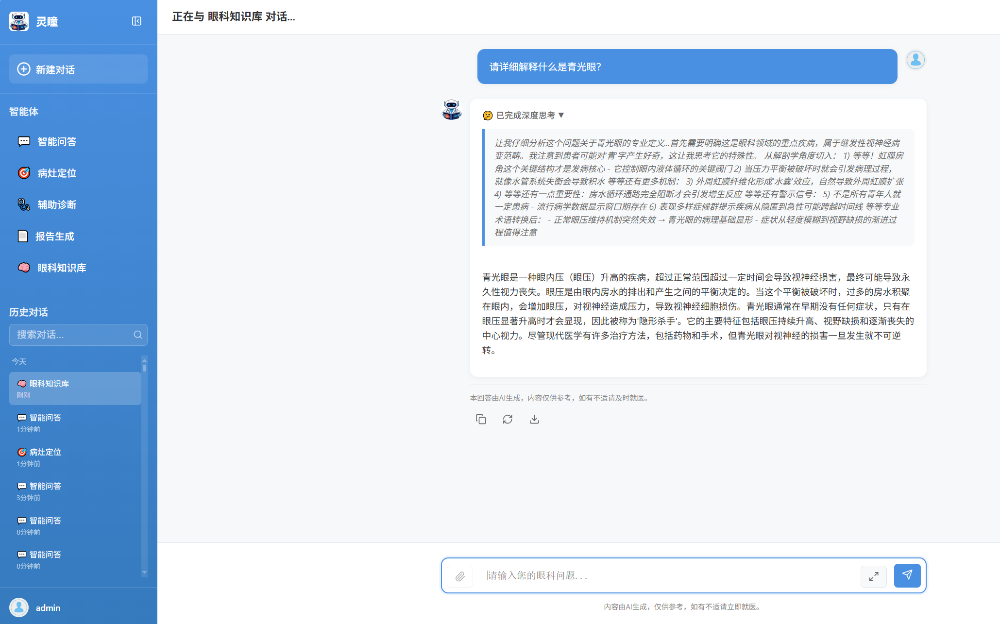

#  "LingTong" Ophthalmic Intelligent Diagnosis System

[English](README.md) | [简体中文](README_zh.md)

## 1. Project Introduction

**"LingTong" Ophthalmic Intelligent Diagnosis System** is a specialized medical AI platform built upon the self-developed **OphVLM-R1 Ophthalmic Multimodal Reasoning Large Model**. Developed by the AI Safety Laboratory team at the School of Artificial Intelligence and Automation, Huazhong University of Science and Technology, this project aims to address the global disparity in high-quality ophthalmic medical resources and the high rates of misdiagnosis and missed diagnosis in primary medical institutions.

Based on the InternLM ecosystem (InternVL3, Intern-S1), the system adopts the **ReAct (Reasoning + Acting) agent architecture** and integrates five professional AI agents: Interactive VQA, Lesion Localization, Diagnostic Assistant, Report Generation, and Ophthalmic Knowledge Base. Through innovative dataset construction methods, a two-stage training architecture, and the ReAct agent system, it achieves a leap in ophthalmic intelligent diagnosis from "perceptual recognition" to "cognitive reasoning," providing clinical practitioners with an efficient, transparent, and trustworthy auxiliary diagnosis solution.

**Core Objective**: To empower clinicians, especially primary healthcare workers, with AI technology to enhance early screening and precise diagnosis capabilities for ophthalmic diseases.

## 2. Quick Start

### Environment Requirements
- Python 3.8+
- 8GB+ RAM (Recommended)
- GPU Support (Optional, for local model deployment)

### Installation Steps

1. **Clone the Project**
   ```bash
   git clone [Project URL]
   cd OphAgent
   ```

2. **Install Dependencies**
   ```bash
   pip install -r requirements.txt
   ```

3. **Configure Environment Variables**
   ```bash
   cp .env.example .env
   # Edit .env file to configure model service information
   ```

4. **Initialize Database**
   ```bash
   python init_db.py
   ```

5. **Start the System**
   ```bash
   python run.py
   ```

6. **Access the System**
   - Open browser: http://localhost:8012
   - Register an account and start using

## 3. System Architecture

The "LingTong" system is built on the ReAct architecture, implementing a closed loop of "Reasoning-Acting," making the AI decision-making process interpretable and traceable.

- **Backend**: Built on the FastAPI framework, supporting asynchronous high-concurrency processing and automatic API documentation generation; uses SQLModel for unified data validation and database model management, selecting SQLite as a lightweight database.
- **Frontend**: Developed with native JavaScript ES6+, ensuring system stability without framework dependencies, with a responsive design adapting to desktop and mobile devices.
- **Communication**: Integrates WebSocket for real-time communication, supporting streaming output of AI responses.
- **Agents**: All five agents follow the ReAct working mode, receiving instructions and first entering the Reasoning phase, then the Acting phase.

```
OphAgent/
├── app/
│   ├── main.py              # FastAPI Main App
│   ├── agents/              # AI Agents (ReAct Architecture)
│   ├── api/                 # API Routes
│   ├── services/            # Business Services
│   └── static/              # Frontend Resources
├── figures/                 # Project Demo Images
├── requirements.txt         # Python Dependencies
└── run.py                   # Startup Script
```

## 4. Core Highlights

- **🧠 OphVLM-R1 Model Driven**: Adopts a lightweight design (2B parameters), possessing deep ophthalmic professional reasoning capabilities despite its small size, supporting the analysis of various ophthalmic image types such as fundus photos, OCT, and anterior segment photos.
- **🔄 ReAct Architecture Design**: The decision-making process of each agent is divided into Reasoning and Acting phases, allowing doctors to clearly understand the AI's reasoning path, breaking the limitation of traditional AI models' "black box operations."
- **🎯 Five Professional Agents**: Covers the full process of diagnosis needs from image analysis and disease diagnosis to report writing and knowledge inquiry.
- **💡 Modularity & Interpretability**: The modular design aligns with doctors' clinical thinking patterns, lowering the barrier to using the AI system and achieving interpretability and traceability of diagnostic decisions.

## 5. Technical Details

### 5.1 Dataset Construction: Closed Loop for High-Quality Reasoning Data Generation

To solve the problems of strong heterogeneity in ophthalmic multimodal data and the lack of reasoning logic, we designed a three-stage closed-loop pipeline of "Data Standardization - Structured Reasoning Synthesis - Expert Collaborative Optimization."


1.  **Data Standardization**: Integrated over 100,000 real clinical cases and 30+ public ophthalmic datasets. Used MinerU to parse electronic medical records and InternVL3-78B to generate visual descriptions.
2.  **Structured Reasoning Synthesis**: Introduced Intern-S1 as the core reasoning engine to generate multi-dimensional instruction data covering "Lesion Localization," "Multimodal Diagnosis," and "Medical Knowledge Q&A," along with Chain of Thought (CoT). Introduced "LVLM-as-a-Judge" mechanism for quality verification.
3.  **Expert Collaborative Optimization**: Ophthalmologists conduct secondary reviews and corrections on difficult samples, building a difficulty-aware dynamic data pool.

### 5.2 Model Training: Two-Stage Progressive Reinforcement Learning Architecture

We use InternVL3-2B as the base model and adopt a two-stage architecture of "Cold-Start Supervised Fine-Tuning + Progressive Curriculum Reinforcement Learning."


1.  **Cold-Start Supervised Fine-Tuning (SFT)**: Uses LoRA technology to inject ophthalmic domain knowledge.
2.  **Progressive Curriculum Reinforcement Learning (RL)**: Introduces the DAPO algorithm and stimulates deep reasoning capabilities through a four-stage curriculum from easy to difficult (Lesion Localization -> Multi-Image Selection -> Open-Ended VQA -> Ophthalmic Knowledge Q&A).

## 6. Model Performance

Based on the latest performance evaluation results, the "LingTong" Ophthalmic Multimodal Reasoning Large Model (OphVLM-R1 / Ours-2B-Preview) has demonstrated excellent performance on the OmniMedVQA-Eye ophthalmic medical Q&A dataset.



- **Comprehensive Performance**: OmniMedVQA-Eye score of **76.34%**, ranking first among all compared models.
- **Parameter Efficiency**: Outperforms larger parameter models (such as HuatuoGPT-V-7B) with only 2B parameters.
- **Professional Advantage**: In-domain accuracy of 67.60% and out-of-domain accuracy of 76.34%, showing good generalization ability and medical professionalism.

## 7. Dataset Examples

The project constructed the high-quality ophthalmic multimodal reasoning dataset **OphReason-Vision**, providing solid support for model training.


This dataset achieves deep alignment of ophthalmic multimodal data and standardized generation of structured reasoning chains for the first time.

## 8. Project Effect Demo

The system integrates five major agents. Here are the actual operating effects of each agent:

### 8.1 Interactive VQA
Supports uploading ophthalmic images for free Q&A interaction and multi-turn follow-up questions.


### 8.2 Lesion Localization
Automatically identifies and annotates lesion areas in ophthalmic images, outputting standardized bounding boxes.


### 8.3 Diagnostic Assistant
Provides multiple possible disease diagnosis suggestions, including confidence levels and diagnostic basis.


### 8.4 Report Generation
Automatically generates structured ophthalmic image diagnostic reports, including imaging findings and diagnostic opinions.


### 8.5 Knowledge Base
Professional ophthalmic medical knowledge Q&A system, citing authoritative sources.


## 9. Development Guide

### Adding a New Agent
1. **Create Agent Module** (`app/agents/new_agent.py`)
2. **Register Agent** (`app/api/router.py`)
3. **Create Frontend UI** (`app/static/js/agents/new_agent.js`)

### Custom Configuration
Edit `app/core/config.py` to adapt to different deployment environments.

## 10. FAQ

1. **Model Service Connection Failure**
   - Check `OPENAI_API_BASE` configuration in `.env`.
   - Confirm if the model service is running normally.

2. **File Upload Issues**
   - Check permissions for `app/static/uploads/` directory.

3. **Database Issues**
   - Run `python init_db.py` to re-initialize.

## 11. Acknowledgements

The successful progress of this project relies on the key support from the InternLM Practical Camp, the InternLM Ecosystem, and the Datawhale Open Source Community. We sincerely thank these open-source communities for providing a solid foundation for this project and jointly promoting the development of the ophthalmic AI field.

## 12. Related Links

- **System Demo Video**: https://www.bilibili.com/video/BV1g4UTBZEEm/
- **Open Source Code**: https://github.com/QiZishi/OphAgent/
- **OphReason-Vision Dataset**: https://www.modelscope.cn/datasets/MoonNight/OphReason-Vision
- **InternVL Open Source**: https://github.com/OpenGVLab/InternVL
- **InternLM Online Experience**: https://chat.intern-ai.org.cn/
- **InternLM Practical Camp**: https://colearn.intern-ai.org.cn/go
- **Datawhale Open Source Community**: https://www.datawhale.cn/
