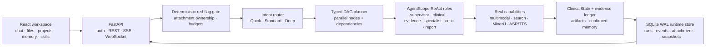

<p align="center">
  
</p>

<h1 align="center">OphAgent · “LingTong” Ophthalmic Intelligent Diagnosis System</h1>

<p align="center"><strong>A durable, safety-gated and streaming ophthalmic Agent workspace</strong></p>

<p align="center">
  <a href="README.md">English</a> · <a href="README_zh.md">简体中文</a>
</p>

<p align="center">
  <a href="https://qizishi.github.io/OphVLM-R1/"></a>
  <a href="https://github.com/QiZishi/OphAgent/"></a>
</p>
<p align="center">
  <a href="https://huggingface.co/QiZishi/OphVLM-R1"></a>
  <a href="https://www.modelscope.cn/models/MoonNight/OphVLM-R1"></a>
</p>
<p align="center">
  <a href="https://huggingface.co/datasets/QiZishi/OphReason-Vision"></a>
  <a href="https://www.modelscope.cn/datasets/MoonNight/OphReason-Vision"></a>
</p>

## Project Links

- **Project page**: <https://qizishi.github.io/OphVLM-R1/>
- **OphAgent system code**: [GitHub](https://github.com/QiZishi/OphAgent/)
- **OphVLM-R1 model**: [Hugging Face](https://huggingface.co/QiZishi/OphVLM-R1) | [ModelScope](https://www.modelscope.cn/models/MoonNight/OphVLM-R1)
- **OphReason-Vision dataset**: [Hugging Face](https://huggingface.co/datasets/QiZishi/OphReason-Vision) | [ModelScope](https://www.modelscope.cn/datasets/MoonNight/OphReason-Vision)

## News

- **2026.07.07** 🎉 Paper “OphVLM-R1: Efficient Ophthalmic Reasoning via Curriculum Reinforcement Learning” accepted by **WAICA 2026**!
  - 📖 Conference: <https://waica2026.worldaic.com.cn/>

- **2025.12.09** 🎉 **Exciting News!** The “LingTong” Ophthalmic Intelligent Diagnosis System has been featured and promoted by Shanghai AI Laboratory and awarded the **Outstanding Project of InternLM Practical Camp**!
  - 📖 Featured Article: <https://mp.weixin.qq.com/s/BTZPUrVtD8nCS_yMwDhhUQ>

- **2025.11.28** 📊 The high-quality ophthalmic multimodal reasoning dataset **OphReason-Vision** subset has been officially open-sourced on the ModelScope platform!
  - 🔗 Dataset Link: <https://www.modelscope.cn/datasets/MoonNight/OphReason-Vision>

- **2025.11.23** 🎬 The demo video for the original five-entry version of the “LingTong” system was released on Bilibili. The current OphAgent architecture has since been comprehensively redesigned.
  - 🎥 Video Link: <https://www.bilibili.com/video/BV1g4UTBZEEm/>

## Background

**“LingTong” Ophthalmic Intelligent Diagnosis System** is a specialized medical AI platform built upon the self-developed **OphVLM-R1 ophthalmic multimodal reasoning model**. Developed by the AI Safety Laboratory team at the School of Artificial Intelligence and Automation, Huazhong University of Science and Technology, the project aims to address the global disparity in high-quality ophthalmic medical resources and the high rates of misdiagnosis and missed diagnosis in primary medical institutions.

Ophthalmic multimodal large language models face three challenges: training data lacking structured reasoning chains, single-stage training that fails to cultivate deep clinical reasoning, and large model sizes that limit deployment in resource-constrained settings. The project addresses these challenges through an integrated data–model–agent stack. OphReason-Vision converts heterogeneous ophthalmic data into expert-verified reasoning trajectories; OphVLM-R1 develops clinical reasoning through a LoRA cold start followed by curriculum reinforcement learning; and OphAgent exposes model, retrieval and specialist capabilities through a durable clinical-assistance runtime.

The current OphAgent combines **AgentScope ReAct agents**, deterministic medical safety gates, typed DAG planning, multimodal tools and provenance-aware retrieval. It exposes three public professional plugins—lesion localization, auxiliary assessment and report generation—while conversation, evidence retrieval, document parsing, speech and memory are coordinated as core capabilities rather than separate top-level agents. Only public execution summaries are displayed; hidden chain-of-thought is never exposed.

**Core objective:** empower clinicians, especially primary healthcare workers, with AI-assisted early screening and precise diagnosis capabilities for ophthalmic diseases. LingTong is a research and clinical-assistance system and is not a substitute for professional medical judgment.

## OphReason-Vision Dataset Pipeline

The three-stage closed loop transforms 100K+ raw clinical cases and 30+ public datasets into 15,418 reasoning trajectories.


### 1. Data Standardization

This stage integrates 100K+ clinical cases with 30+ public datasets through a dual-stream strategy. The **text stream** parses unstructured electronic medical records into standardized JSON and resolves inconsistent terminology through a curated ophthalmic synonym table. The **visual stream** generates detailed textual descriptions for datasets that contain only image-level labels, enriching the visual evidence available for subsequent reasoning synthesis.

### 2. Structured Reasoning Synthesis

Intern-S1 generates multidimensional instructions covering lesion localization, multimodal diagnosis, and knowledge question answering. For each instruction, it produces a Chain-of-Thought trajectory that follows the clinical diagnostic workflow:

> visual sign identification → knowledge retrieval → pathological analysis → clinical decision

An LVLM-as-a-Judge filter uses Intern-S1 with threshold $\tau=0.7$, determined on 500 expert-reviewed pilot samples to maximize F1. It evaluates medical correctness, reasoning consistency, step completeness, and clarity, while flagging hallucinated findings, incorrect disease classification, and logically inconsistent steps.

### 3. Expert-Collaborative Optimization

Three board-certified ophthalmologists review the 18% of samples flagged as difficult. Inter-rater agreement reaches Cohen's $\kappa=0.82$, and disagreements are discussed until consensus. Difficulty is graded from base-model perplexity so that the curriculum can progress from easier perception tasks to harder long-form reasoning tasks. Perceptual hashing, source-identifier cross-referencing, and manual source audits are used to reduce contamination with external benchmarks.

| Split | Records | Purpose |
|---|---:|---|
| Cold-start SFT | 3,418 | Domain knowledge injection |
| Four curriculum stages | 10,000 | Progressive reasoning training |
| In-domain evaluation | 2,000 | Held-out clinical evaluation |
| **Total** | **15,418** | **13,418 train + 2,000 eval** |

## OphVLM-R1 Training Framework and Algorithms

OphVLM-R1 is a 2B-parameter model based on InternVL3.5-2B. Its lightweight scale supports deployment on consumer-grade GPUs while retaining capacity for multimodal clinical reasoning. Training proceeds in two stages: parameter-efficient supervised fine-tuning injects ophthalmic knowledge, followed by curriculum reinforcement learning that progressively develops diagnostic reasoning.


### Stage 1: LoRA Supervised Fine-Tuning

The 3,418-sample cold-start subset injects broad ophthalmic domain knowledge with Low-Rank Adaptation (LoRA), constraining weight updates to low-rank decomposition. The adapters use rank $r=64$ and scaling $\alpha=128$ on the $W_q$, $W_k$, $W_v$, and $W_o$ attention projections. Training uses cosine annealing from a learning rate of $1\times10^{-4}$, batch size 32, and 3 epochs; approximately 0.5% of the total parameters are trainable.

### Stage 2: Curriculum Reinforcement Learning

Four tasks are ordered by increasing diagnostic complexity:

1. Lesion Localization.
2. Multi-image Selection.
3. Report Generation.
4. Knowledge Q&A.

Group Sequence-level Policy Optimization (GSPO) addresses instability from token-level policy ratios in long reasoning chains by computing importance ratios at sequence level. Each curriculum stage optimizes a mixed reward combining rule-based verifiable reward and an Intern-S1-mini judge reward, with weights $\lambda_1=0.6$ and $\lambda_2=0.4$. Training uses $G=8$, $\varepsilon=0.2$, learning rate $5\times10^{-6}$, $\beta_{\mathrm{KL}}=0.04$, and 2 epochs per stage.

### Hard-Sample Dynamic Backtracking

An on-policy resampling mechanism tracks prompts whose rewards remain below a threshold over the most recent $k=5$ rounds and increases their sampling probability according to consecutive failure counts. It stores only prompt indices and failure statistics, ensuring fresh on-policy rollouts whenever a difficult prompt is revisited. Resampling is capped at 30% of each batch to retain coverage of already learned samples.

## Model Performance

Accuracy is reported in percent. The average is reference-only because the benchmarks use different formats, difficulties, and random baselines.

| Model | In-Domain | Fundus | Omni-Eye | Avg.* |
|---|---:|---:|---:|---:|
| InternVL3.5-2B | 34.50 | 36.61 | 55.47 | 42.19 |
| InternVL3.5-4B | 36.23 | 42.10 | 77.51 | 51.95 |
| Lingshu-7B | **44.20** | 41.29 | 87.42 | **57.64** |
| OphthaReason-Qwen-3B | 36.60 | 38.87 | 86.86 | 54.11 |
| **OphVLM-R1-2B (ours)** | 38.40 | 42.58 | **88.24** | 56.41 |

Within the reported comparisons, OphVLM-R1 achieves 88.24% on out-of-domain OmniMedVQA-Eye and 42.58% on Fundus-MMBench. Its 56.41% reference average exceeds InternVL3.5-4B at 51.95% and the domain-adapted OphthaReason-Qwen-3B at 54.11%. Ablations reduce Omni-Eye by 26.21 points with SFT only, 10.10 points with one-shot RL, 3.72 points when GSPO is replaced by token-level GRPO, and 2.12 points without hard-sample backtracking. Results are single runs without confidence intervals or significance tests, and comparisons with off-the-shelf 7B/8B models should be interpreted cautiously because training-data exposure and model scale are not controlled.

## OphAgent Design Architecture

OphAgent-Pro 3.0 is not a collection of five isolated chat endpoints. It is a stateful Agent runtime: every request is triaged, routed into a bounded execution profile, recorded as a durable Run, and delivered to the React workspace through replayable events.


```mermaid
flowchart LR
    UI["React workspace<br/>chat · files · projects · memory · skills"] --> API["FastAPI<br/>auth · REST · SSE · WebSocket"]
    API --> GATE["Deterministic red-flag gate<br/>attachment ownership · budgets"]
    GATE --> ROUTER["Intent router<br/>Quick · Standard · Deep"]
    ROUTER --> DAG["Typed DAG planner<br/>parallel nodes + dependencies"]
    DAG --> AGENTS["AgentScope ReAct roles<br/>supervisor · clinical · evidence · specialist · critic · report"]
    AGENTS --> TOOLS["Real capabilities<br/>multimodal · search · MinerU · ASR/TTS"]
    TOOLS --> STATE["ClinicalState + evidence ledger<br/>artifacts · confirmed memory"]
    STATE --> STORE["SQLite WAL runtime store<br/>runs · events · attachments · snapshots"]
    STORE --> API
```

### What is new in 3.0

- **Durable Run protocol** — every state transition, tool result, artifact and public progress event has a stable `run_id`, `trace_id` and monotonic sequence.
- **True response streaming** — terminal prose is emitted as `answer.delta` events over SSE where the route supports provider streaming. Early events are backfilled from the durable cursor, and reconnects resume without duplicating content.
- **Quick / Standard / Deep routing** — deterministic intent and risk rules select a bounded plan. Emergency signals override a requested quick mode.
- **Typed clinical state** — user facts, missing information, red flags, evidence and model observations remain distinct; model inference cannot silently become a confirmed patient fact.
- **Composable professional plugins** — `lesion_localizer`, `aux_diagnosis` and `report_generator` can be selected explicitly or composed by the router.
- **Controlled memory and skills** — memory enters `proposed` before confirmation; imported `SKILL.md` packages stay quarantined until structure, dependency, safety and checksum gates pass.
- **Real capability health** — unavailable models, search, parsing or speech services are reported as unavailable. The runtime never substitutes canned medical conclusions.
- **Privacy-aware observability** — OpenTelemetry exports only allowlisted identifiers, status, latency and aggregate token usage; prompts, patient text, file contents and secrets are excluded.

## Product Capabilities

| Capability | Current behavior |
|---|---|
| Multiturn ophthalmic Q&A | Persistent conversations, context snapshots, bounded history compression and follow-up route inheritance |
| Multimodal review | Authenticated fundus/OCT/anterior-segment uploads, validated observations and optional normalized/pixel regions |
| Lesion localization | Renders only coordinate-validated boxes; no box is fabricated when the model does not return a valid region |
| Auxiliary assessment | Qualitative differentials with supporting, opposing and missing evidence; support levels are not disease probabilities |
| Report generation | Citation-aware Markdown reports, editable artifacts and MD/PDF/DOCX/JPG export |
| Knowledge retrieval | Guideline-first BM25 + optional BGE-M3 embeddings and Rerank, lifecycle filtering, PDF page visuals and lightweight graph expansion |
| Speech and documents | Optional server-side ASR/TTS, authenticated audio upload and MinerU/local document parsing |
| Workspace management | Projects, private files, generated artifacts, provider overrides, memory, skills, source governance and capability health |

## Execution Profiles

| Profile | Typical request | Runtime behavior |
|---|---|---|
| **Quick** | Simple non-medical fact or arithmetic | One bounded direct-answer call; no retrieval or report pipeline |
| **Standard** | Knowledge Q&A, a single image task or routine clinical request | Relevant clinical, evidence and imaging nodes may execute in parallel before synthesis |
| **Deep** | Complex multimodal assessment, high-risk symptoms or report composition | Specialist review plus draft → critic → final safety pipeline |

The public UI shows concise stage summaries, validated outputs and evidence—not private chain-of-thought.

## Safety and Reliability

- Deterministic red-flag patterns run before model routing and can force emergency escalation.
- Attachments are referenced by authenticated IDs. Public REST and WebSocket APIs reject client-supplied server file paths.
- Run budgets bound model calls, tokens, wall time and node concurrency; cancellation is persisted and propagated.
- Required-node failures produce structured failure events. Optional capability failures yield explicit warnings.
- Citations are checked at claim-paragraph level, not merely by the presence of one marker.
- Expired or superseded knowledge sources are excluded by default; low-trust sources are down-weighted and labeled.
- Restart recovery marks unfinished runs as interrupted and preserves completed work for resume/retry.
- This is a research-grade clinical assistance system. It does not provide a definitive diagnosis or replace emergency and professional medical assessment.

## Technology Stack

| Layer | Implementation |
|---|---|
| Web client | React 19, TypeScript 5.8, Vite 6, responsive desktop/mobile UI |
| API | FastAPI 0.138, authenticated REST, Server-Sent Events and WebSocket compatibility |
| Agent runtime | AgentScope 1.0 ReAct roles, deterministic routing and typed async DAG execution |
| Persistence | SQLModel conversation/account database + SQLite WAL runtime event store |
| Knowledge | BM25, NumPy vector persistence, OpenAI-compatible embeddings/Rerank, PDF page evidence, OphthaGraph |
| Observability | OpenTelemetry with export-time privacy filtering |
| Quality | Pytest, Vitest, ESLint, Ruff, Playwright and axe accessibility checks |

## Repository Layout

```text
OphAgent/
├── app/
│   ├── api/             # Authenticated REST, SSE and WebSocket surfaces
│   ├── auth/            # JWT cookies, session revocation and login controls
│   ├── domain/          # Run, event, evidence and ClinicalState contracts
│   ├── evolution/       # Content-free online signals and offline gated harness
│   ├── knowledge/       # Source lifecycle, hybrid retrieval and OphthaGraph
│   ├── observability/   # Privacy-filtered tracing
│   ├── plugins/         # Public professional plugin registry
│   ├── runtime/         # Router, planner, AgentScope roles, store and exports
│   ├── services/        # Memory, skill and encrypted provider configuration
│   ├── tools/           # Multimodal, search, document and speech clients
│   └── main.py
├── data/knowledge_base/raw/
├── frontend/            # React workspace, unit tests and Playwright scenarios
├── scripts/             # Portable knowledge CLI and optional evolution installer
├── skills/              # Built-in gated Agent skills
├── tests/               # Backend contract, safety and orchestration tests
├── .env.example
├── init_db.py
└── run.py
```

## Quick Start

### Requirements

- Python 3.11+
- Node.js 20+ and npm
- An OpenAI-compatible main model and multimodal sub-agent model
- 8 GB+ RAM recommended; GPU is only required when hosting models locally

### Installation

```bash
git clone git@github.com:QiZishi/OphAgent.git
cd OphAgent

python3.11 -m venv venv
source venv/bin/activate
pip install -r requirements.txt

npm --prefix frontend ci
npm --prefix frontend run build

cp .env.example .env
# Configure JWT_SECRET_KEY, AGENT_* and SUB_AGENT_* in .env.

python init_db.py
python run.py
```

Open <http://localhost:8013>, create an account, and start a conversation. With `STRICT_STARTUP=true`, startup fails early when required model credentials are missing.

### Minimum configuration

```dotenv
JWT_SECRET_KEY=replace-with-a-long-random-secret

AGENT_URL=https://your-provider.example/v1
AGENT_API_KEY=...
AGENT_MODEL=...

SUB_AGENT_URL=https://your-provider.example/v1
SUB_AGENT_API_KEY=...
SUB_AGENT_MODEL=...
```

Embedding, Rerank, AnySearch/Tavily, ASR, TTS, MinerU and OTLP are optional. Their state is visible in the capability panel, and each degrades independently.

## Knowledge Corpus

The application automatically indexes supported files under `data/knowledge_base/raw/`. The portable CLI can import additional directories without developer-specific absolute paths:

```bash
python scripts/build_knowledge_base.py \
  --collect \
  --source local-guidelines=/absolute/path/to/guidelines

python scripts/build_knowledge_base.py --build-index --lexical-only
python scripts/build_knowledge_base.py --search "glaucoma visual field follow-up"
python scripts/build_knowledge_base.py --stats
```

Use only material you are authorized to process and distribute. Uploaded sources begin as unverified and should be reviewed in the source-governance workspace.

## API and Streaming

| Endpoint | Purpose |
|---|---|
| `POST /auth/register`, `POST /auth/login` | Create or authenticate an account |
| `POST /api/v1/conversations/{id}/messages` | Create an idempotent message and background Run |
| `GET /api/v1/runs/{id}` | Read durable Run state |
| `GET /api/v1/runs/{id}/events` | Replay ordered events after a cursor |
| `GET /api/v1/runs/{id}/events/stream` | SSE stream with replay cursor and heartbeat |
| `POST /api/v1/upload` | Authenticated typed attachment upload |
| `GET /api/v1/artifacts`, `GET /api/v1/attachments` | Private generated and uploaded files |
| `WS /ws/runs/{id}` | Authenticated WebSocket event bridge |

Interactive OpenAPI documentation is available at `/docs`.

## Development

```bash
source venv/bin/activate
pip install -r requirements-dev.txt

python -m ruff check app tests scripts run.py init_db.py
pytest

npm --prefix frontend test -- --run
npm --prefix frontend run lint
npm --prefix frontend run build

npm --prefix frontend exec playwright install chromium
npm --prefix frontend run test:e2e -- workspace.spec.ts
```

When adding a capability:

1. Add or extend typed input/output contracts in `app/domain/`.
2. Register external behavior in `app/tools/` and declare real health semantics.
3. Update routing/planning in `app/runtime/` without bypassing risk gates or budgets.
4. Add replayable public events and tests for ownership, failure and cancellation paths.
5. Expose only validated public summaries in the React workspace.

## Controlled Offline Evolution

Online feedback is stored as bounded, content-free signals; it cannot rewrite production prompts, code, skills or medical facts. Candidate changes run in isolated Git worktrees and require paired evaluation, sealed-test attestation, slice-level non-regression, cost/latency gates and human approval before promotion. Optional official integrations are installed separately with `requirements-evolution.txt`.

## Open Source Status

### Available

- **System code**: frontend/backend implementation, API routes, services, and database models.
- **OphReason-Vision subset**: 3,418 cold-start samples on Hugging Face and ModelScope.
- **OphVLM-R1 model**: model weights on Hugging Face and ModelScope.

### Planned Releases

- Remaining OphReason-Vision records after completion of privacy and ethics review.
- Cold-start SFT and curriculum reinforcement learning scripts.
- Model evaluation code.

## Citation

```bibtex
@inproceedings{qi2026ophvlm,
  title={OphVLM-R1: Efficient Ophthalmic Reasoning via Curriculum Reinforcement Learning},
  author={Qi, Zishi and Hu, Xiaoya and Pan, Huilin and Gao, Ang and Hou, Jiaxin and Li, Jiankun and Qian, Yongao},
  booktitle={Proceedings of the World Artificial Intelligence Conference Academic (WAICA)},
  year={2026}
}
```

## Acknowledgements

The development of this project benefits from the InternLM ecosystem, OpenGVLab, the InternLM Practical Camp, and the Datawhale open-source community. We sincerely thank these communities for providing the model, tooling, and learning resources that support the project, and we thank the ophthalmologists who contributed to data review and quality assurance.

## Related Links

- **InternVL**: <https://github.com/OpenGVLab/InternVL>
- **InternLM online experience**: <https://chat.intern-ai.org.cn/>
- **InternLM Practical Camp**: <https://colearn.intern-ai.org.cn/go>
- **Datawhale**: <https://www.datawhale.cn/>
