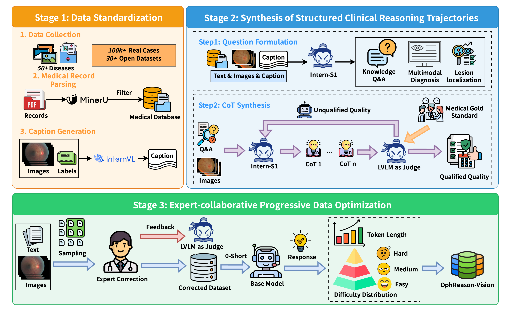
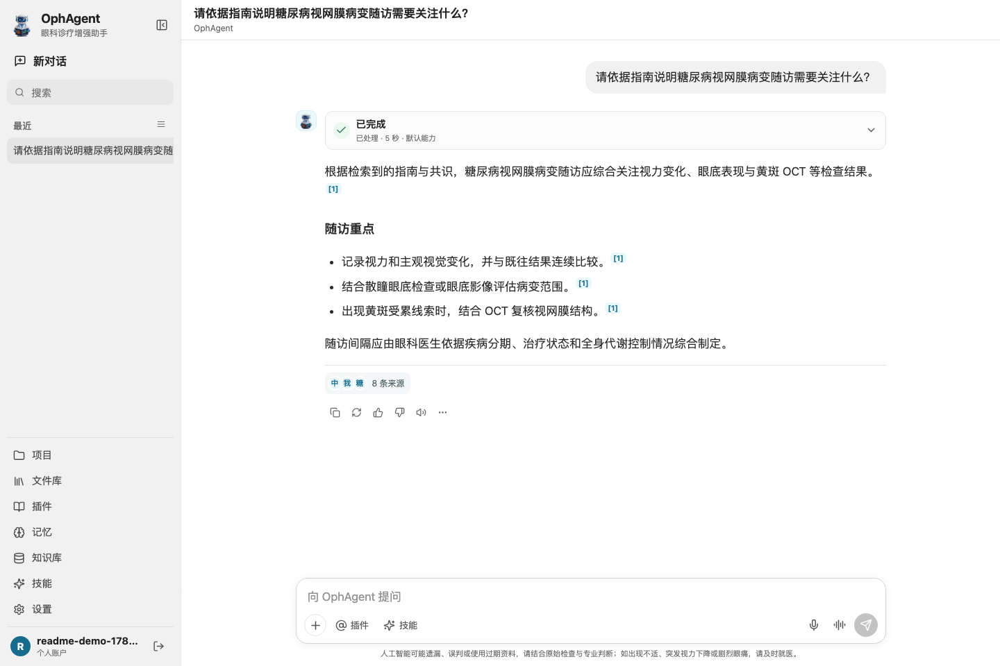
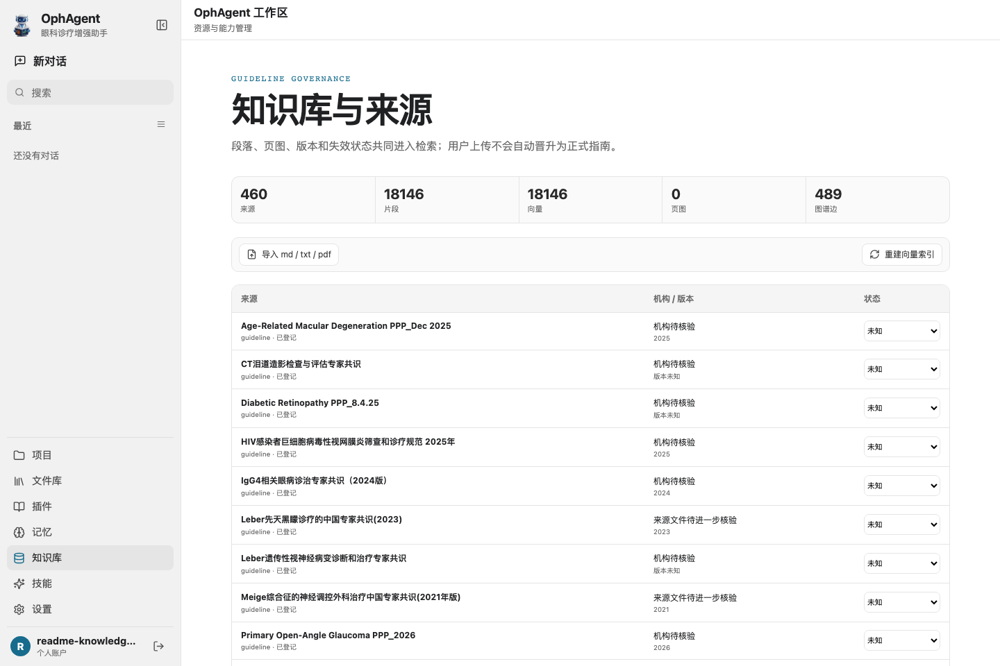
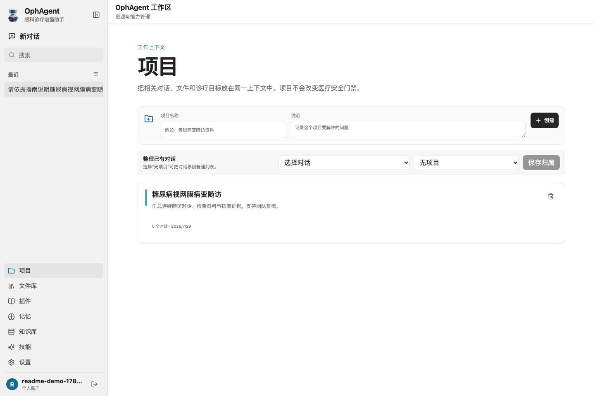
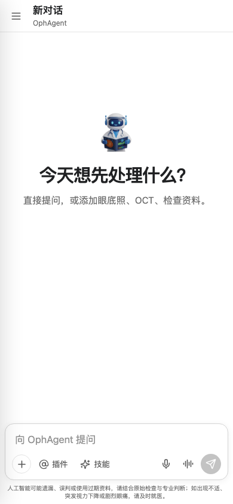
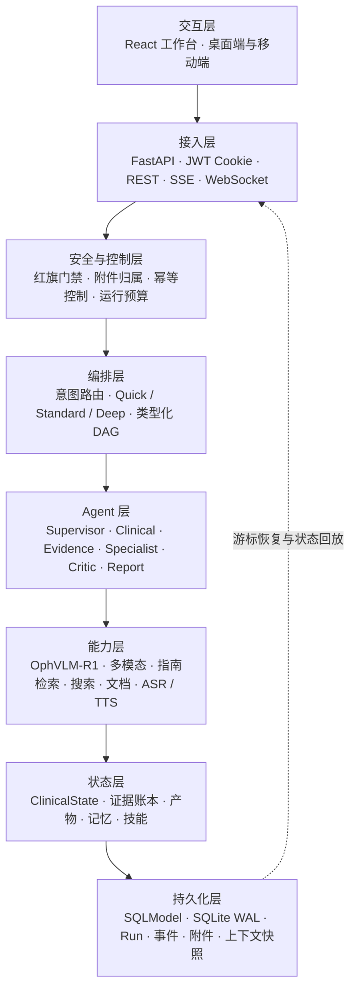
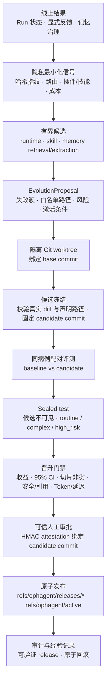

<p align="center">
  
</p>

<h1 align="center">OphAgent · “灵瞳”眼科智慧诊疗系统</h1>

<p align="center"><strong>可持久化、带安全门禁、支持流式响应的眼科 Agent 工作台</strong></p>

<p align="center">
  <a href="README.md">English</a> · <a href="README_zh.md">简体中文</a>
</p>

<p align="center">
  <a href="https://qizishi.github.io/OphVLM-R1/"></a>
  <a href="https://github.com/QiZishi/OphAgent/"></a>
  <a href="https://moonnight-ophagent.ms.show/"></a>
</p>
<p align="center">
  <a href="https://huggingface.co/QiZishi/OphVLM-R1"></a>
  <a href="https://www.modelscope.cn/models/MoonNight/OphVLM-R1"></a>
</p>
<p align="center">
  <a href="https://huggingface.co/datasets/QiZishi/OphReason-Vision"></a>
  <a href="https://www.modelscope.cn/datasets/MoonNight/OphReason-Vision"></a>
</p>

## 项目链接汇总

- **项目主页**：<https://qizishi.github.io/OphVLM-R1/>
- **OphAgent 系统代码**：[GitHub](https://github.com/QiZishi/OphAgent/)
- **OphAgent 在线体验**：[ModelScope Studio](https://www.modelscope.cn/studios/MoonNight/OphAgent) — 直达链接 <https://moonnight-ophagent.ms.show/>
- **OphVLM-R1 模型**：[Hugging Face](https://huggingface.co/QiZishi/OphVLM-R1) | [ModelScope](https://www.modelscope.cn/models/MoonNight/OphVLM-R1)
- **OphReason-Vision 数据集**：[Hugging Face](https://huggingface.co/datasets/QiZishi/OphReason-Vision) | [ModelScope](https://www.modelscope.cn/datasets/MoonNight/OphReason-Vision)

## 新闻动态

- **2026.07.29** 🚀 **OphAgent 2.0 发布**：完成可持久化 Agent 运行时、类型化 DAG 编排、SSE 流式响应、证据治理、多模态插件、项目化工作区、医疗安全门禁与受控自进化 Harness 升级。

- **2026.07.07** 🎉 论文 “OphVLM-R1: Efficient Ophthalmic Reasoning via Curriculum Reinforcement Learning” 被 **WAICA 2026** 接收！
  - 📖 会议官网：<https://waica2026.worldaic.com.cn/>

- **2025.12.09** 🎉 **重磅喜讯！** “灵瞳”眼科智慧诊疗系统获得上海人工智能实验室大力宣传推荐，并荣获**书生大模型实战营优秀项目**荣誉！衷心感谢上海人工智能实验室与书生大模型实战营的认可与支持！
  - 📖 宣传文章：<https://mp.weixin.qq.com/s/BTZPUrVtD8nCS_yMwDhhUQ>

- **2025.11.28** 📊 高质量眼科多模态推理数据集 **OphReason-Vision** 部分子集已在 ModelScope 平台正式开源发布！
  - 🔗 数据集链接：<https://www.modelscope.cn/datasets/MoonNight/OphReason-Vision>

- **2025.11.23** 🎬 “灵瞳”眼科智慧诊疗系统实机演示视频在 B 站发布。
  - 🎥 视频链接：<https://www.bilibili.com/video/BV1g4UTBZEEm/>

## 项目背景

**“灵瞳”眼科智慧诊疗系统**是基于自主研发的 **OphVLM-R1 眼科多模态推理模型**构建的专业化医疗 AI 平台。该项目由华中科技大学人工智能与自动化学院人工智能安全实验室团队开发，旨在缓解全球眼科优质医疗资源分布不均，以及基层医疗机构误诊、漏诊率较高等现实问题。

眼科多模态大语言模型面临三大挑战：训练数据缺乏结构化推理链、单阶段训练难以培养深度临床推理能力，以及模型规模过大制约资源受限环境中的部署。项目通过一体化的“数据—模型—智能体”技术栈解决这些问题：OphReason-Vision 将异构眼科数据转化为经过专家验证的推理轨迹；OphVLM-R1 通过 LoRA 冷启动和课程强化学习获得临床推理能力；OphAgent 则通过可持久化临床辅助运行时统一调度模型、检索与专科能力。

当前 OphAgent 结合 **AgentScope ReAct 智能体**、确定性医疗安全门禁、类型化 DAG 规划、多模态工具、带来源治理的知识检索与受控自进化 Harness。系统对外提供病灶定位、辅助评估和报告生成三个专业插件；对话、证据检索、文档解析、语音和记忆则作为核心能力统一编排。界面只呈现公开执行摘要，不展示隐藏 Chain-of-Thought。

**核心目标：**通过 AI 技术赋能临床医生，尤其是基层医疗工作者，提升眼科疾病的早期筛查与精准诊断能力。“灵瞳”目前定位为研究与临床辅助系统，不能替代专业医疗判断。

## OphReason-Vision 数据集流水线

三阶段闭环流水线将 100K+ 原始临床案例和 30+ 公开数据集转化为 15,418 条推理轨迹。



### 1. 数据标准化

该阶段以双流策略整合 100K+ 临床案例与 30+ 公开数据集。**文本流**将非结构化电子病历解析为标准化 JSON，并通过人工整理的眼科同义词表解决术语不一致问题。**视觉流**为仅包含图像级标签的数据生成详细文本描述，补充后续推理合成所需的视觉证据。

### 2. 结构化推理合成

Intern-S1 生成覆盖病灶定位、多模态诊断和知识问答的多维指令，并为每条指令依照临床诊断工作流构建 Chain-of-Thought：

> 视觉体征识别 → 知识检索 → 病理分析 → 临床决策

质量控制采用基于 Intern-S1 的 LVLM-as-a-Judge，阈值 τ = 0.7 由 500 条专家审核的试点样本确定，以最大化 F1。评判维度包括医学正确性、推理一致性、步骤完整性和清晰度，并识别虚构影像发现、疾病分类错误和逻辑不一致等问题。

### 3. 专家协作优化

三名认证眼科医生审核被标记为困难的 18% 样本，评估者间一致性达到 Cohen's κ = 0.82，分歧通过讨论解决直至达成共识。样本难度依据基座模型困惑度划分，使训练课程能够从较简单的视觉感知逐步过渡到长文本临床推理。数据同时通过感知哈希、来源标识符交叉比对和人工来源审计降低与外部评测基准的数据污染风险。

| 划分 | 记录数 | 用途 |
|---|---:|---|
| 冷启动 SFT | 3,418 | 注入领域知识 |
| 四个课程阶段 | 10,000 | 渐进式推理训练 |
| 域内评估 | 2,000 | 留出临床评估 |
| **总计** | **15,418** | **训练 13,418 + 评估 2,000** |

## OphVLM-R1 模型训练框架与算法

OphVLM-R1 是以 InternVL3.5-2B 为基座的 2B 参数模型。其轻量化规模兼顾消费级 GPU 部署与多模态临床推理能力。整体训练分为两个阶段：第一阶段通过参数高效监督微调注入眼科领域知识，第二阶段通过课程强化学习逐步培养诊断推理能力。


### 阶段一：LoRA 监督微调

使用 3,418 条冷启动样本，通过 Low-Rank Adaptation（LoRA）注入广泛的眼科领域知识，并将权重更新约束为低秩分解。适配器在 W<sub>q</sub>、W<sub>k</sub>、W<sub>v</sub> 和 W<sub>o</sub> 注意力投影上使用 rank r = 64、scaling α = 128；学习率从 1 × 10<sup>−4</sup> 开始并采用余弦退火，批次大小为 32，共训练 3 epochs，可训练参数约占总参数的 0.5%。

### 阶段二：课程强化学习

四类任务按诊断复杂度递增排列：

1. 病灶定位。
2. 多图选择。
3. 报告生成。
4. 知识问答。

Group Sequence-level Policy Optimization（GSPO）通过在序列级计算重要性比率，缓解长推理链中 token-level 策略比率带来的训练不稳定。每个课程阶段优化规则可验证奖励与 Intern-S1-mini judge reward 的加权组合，权重为 λ<sub>1</sub> = 0.6 和 λ<sub>2</sub> = 0.4。训练配置为 G = 8、ε = 0.2、学习率 5 × 10<sup>−6</sup>、β<sub>KL</sub> = 0.04，每阶段训练 2 epochs。

### 困难样本动态回溯

on-policy 重采样机制跟踪最近 k = 5 轮中持续低于奖励阈值的 prompt，并依据连续失败次数提高困难样本的采样概率。系统仅保存 prompt 索引与失败统计，确保每次重新访问困难 prompt 时生成新的 on-policy rollout。重采样比例不超过单个 batch 的 30%，以维持对已掌握样本的覆盖。

## 模型实验性能

表中指标为准确率（%）。由于基准的任务形式、难度和随机基线不同，平均值仅供参考。

| 模型 | In-Domain | Fundus | Omni-Eye | 平均* |
|---|---:|---:|---:|---:|
| InternVL3.5-2B | 34.50 | 36.61 | 55.47 | 42.19 |
| InternVL3.5-4B | 36.23 | 42.10 | 77.51 | 51.95 |
| Lingshu-7B | **44.20** | 41.29 | 87.42 | **57.64** |
| OphthaReason-Qwen-3B | 36.60 | 38.87 | 86.86 | 54.11 |
| **OphVLM-R1-2B（本文）** | 38.40 | 42.58 | **88.24** | 56.41 |

在论文报告的对比中，OphVLM-R1 在域外 OmniMedVQA-Eye 和 Fundus-MMBench 上分别达到 88.24% 和 42.58%；56.41% 的参考平均值高于 InternVL3.5-4B 的 51.95% 和 OphthaReason-Qwen-3B 的 54.11%。在 Omni-Eye 消融实验中，仅 SFT、一次性 RL、将 GSPO 替换为 token-level GRPO、移除困难样本回溯分别下降 26.21、10.10、3.72 和 2.12 个百分点。所有结果来自单次运行，未提供置信区间或显著性检验；与 off-the-shelf 7B/8B 模型的比较还受到训练数据暴露与参数规模差异影响，需要谨慎解读。

## OphAgent

**为你整理眼科问题，随上下文持续工作。**

OphAgent 是面向眼科研究与临床辅助场景的全栈 Agent 工作台——可部署在自己的设备或服务器上，通过技能与专业插件扩展能力，并在同一条对话中组织影像、文档、指南证据和报告。

| | |
|---|---|
| **持续运行** | Conversation、Run、事件、附件和上下文快照完整持久化；刷新、重连、排队补充、立即打断和服务恢复都有清晰状态。 |
| **证据优先** | 指南优先混合检索、来源生命周期、引用账本和段落级主张检查，让回答能够回到来源复核。 |
| **后台校验** | 红旗规则、附件归属、预算、坐标和引用校验在后台运行；失败草稿不会公开，修复成功后只呈现最终有效结果。 |
| **多模态并行** | 眼底照、OCT、眼前节影像、PDF、文本与音频进入类型化 DAG，由相关节点并行处理。 |
| **易于扩展** | 三个专业插件、内置可信 Skill、用户可审批的导入 Skill、记忆、OpenAI-compatible Provider 与外部工具按统一契约组合。 |
| **受控自进化** | 低权限 Memory 在线 CRUD 与低风险 Skill 效用可随使用更新；内容、安全、权限和代码等高风险变更进入离线评测与人工审批。 |
| **随处可用** | 响应式 React 工作台覆盖桌面端和移动端，项目、文件、知识、技能和设置共享同一工作空间。 |

<details>
<summary><b>OphAgent 可以做什么</b></summary>

<br>

- **眼科问答与指南检索**：连续追问、自动路由、来源引用和证据回看。
- **多模态资料复核**：上传眼底照、OCT、眼前节影像、检查文档和音频。
- **专业插件工作流**：按需组合病灶定位、辅助评估和报告生成。
- **项目化资料管理**：把对话、私人文件、生成产物和诊疗目标归集到同一项目。
- **可编辑报告**：在文档工作区继续编辑，并导出 MD、PDF、DOCX 或 JPG。
- **个性化能力**：在线新增、查询、更新和删除记忆，管理技能、Provider 配置和知识来源。
- **运行中追加要求**：任务执行期间可选择排队到下一节点，或立即打断并从检查点按新要求继续。
- **安全自进化**：根据运行结果与显式反馈生成候选，并在独立 Harness 中验证、审批、发布或回滚。

</details>

---

## OphAgent 章节导航

- [快速开始](#快速开始)
- [产品能力](#产品能力)
- [设计架构](#设计架构)
- [执行档位](#执行档位)
- [医疗安全与可靠性](#医疗安全与可靠性)
- [自进化 Harness](#自进化-harness)
- [技术栈](#技术栈)
- [项目结构](#项目结构)
- [知识语料](#知识语料)
- [API 与流式事件](#api-与流式事件)
- [开发说明](#开发说明)

---

## 快速开始

### 环境要求

- Python 3.11+
- Node.js 20+ 与 npm
- OpenAI-compatible 主 Agent 模型和多模态 Sub-agent 模型
- 推荐 8 GB+ RAM；使用本地模型时按模型需求准备 GPU

### 1. 安装

```bash
git clone https://github.com/QiZishi/OphAgent.git
cd OphAgent

python3.11 -m venv venv
source venv/bin/activate
pip install -r requirements.txt

npm --prefix frontend ci
npm --prefix frontend run build
```

### 2. 配置

```bash
cp .env.example .env
```

在 `.env` 中填写最小运行配置：

```dotenv
JWT_SECRET_KEY=请替换为足够长的随机字符串

AGENT_URL=https://your-provider.example/v1
AGENT_API_KEY=...
AGENT_MODEL=...

SUB_AGENT_URL=https://your-provider.example/v1
SUB_AGENT_API_KEY=...
SUB_AGENT_MODEL=...
```

### 3. 启动

```bash
python init_db.py
python run.py
```

打开 <http://localhost:8013>，创建账号并开始使用。默认 `STRICT_STARTUP=true`，启动时会校验必需模型配置。Embedding、Rerank、AnySearch/Tavily、ASR、TTS、MinerU 与 OTLP 均为可选能力，可在工作区查看连接状态。



---

## 产品能力

| 能力 | 使用体验 |
|---|---|
| 多轮眼科问答 | 持久化 Conversation、上下文快照、有界历史压缩和追问路由继承 |
| 多模态复核 | 经过鉴权的眼底照、OCT、眼前节影像上传，返回经校验的观察与像素/归一化区域 |
| 病灶定位 | 对模型返回区域执行像素与归一化坐标校验，在原图上呈现可复核病灶框 |
| 辅助评估 | 给出定性鉴别的支持、反对与缺失证据；支持程度不等同于患病概率 |
| 报告生成 | 带引用的 Markdown 报告、可编辑产物以及 MD/PDF/DOCX/JPG 导出 |
| 知识检索 | 指南优先 BM25 + 可选 BGE-M3 Embedding/Rerank、来源生命周期、PDF 页图与轻量图谱扩展 |
| 语音与文档 | 可选服务端 ASR/TTS、鉴权音频上传、MinerU/本地文档解析 |
| 工作区管理 | 项目、私人文件、生成产物、个人 Provider 配置、记忆、技能、来源治理与能力健康状态 |
| 运行中干预 | 新要求可按 FIFO 排队到下一节点，也可立即打断；系统从持久化检查点自动恢复并重建后续计划 |

以下截图均由当前仓库代码连接真实后端，在独立本地演示环境中完成注册、提问、检索和工作区操作后直接截取。

### 知识库与来源治理

知识工作区集中呈现来源、片段、向量、页图和图谱边统计，并支持资料导入、索引重建以及来源版本和有效状态管理。



### 项目化诊疗工作区

项目用于归集相关对话、文件和诊疗目标；文件库、插件、记忆、知识库、技能与设置共享同一鉴权工作区。



### 响应式移动端

同一套 React 工作台适配桌面端与移动端，可在移动设备上发起对话、添加附件、选择插件和技能。

<p align="center">
  
</p>

---

## 设计架构



### 运行时关键特性

- **可持久化 Run 协议**：每次状态迁移、工具结果、生成产物和公开进度事件都有稳定的 `run_id`、`trace_id` 与单调递增序号。
- **经校验后发布回答**：Provider 草稿在后台完成安全、引用与格式后处理后，才以 `answer.delta` 公开；失败原因会进入重试上下文，系统回退对应节点并原位替换结果，不把坏草稿或修复过程展示给用户。
- **运行中双模式干预**：`queue` 将新要求持久化并按 FIFO 在下一节点边界应用；`interrupt` 取消当前节点、保存原因并从检查点自动恢复。回答、报告产物和终态事件在同一事务中发布，并同时检查待处理干预。
- **Quick / Standard / Deep 路由**：确定性的意图与风险规则选择有界计划，急症红旗可覆盖用户指定的 Quick 模式。
- **类型化临床状态**：用户事实、缺失信息、红旗、证据与模型观察分别进入明确字段。
- **可组合专业插件**：`lesion_localizer`、`aux_diagnosis`、`report_generator` 可由用户指定，也可由路由器组合调用。
- **在线记忆与双轨技能**：Memory 保持在线 CRUD；医疗事实可先进入 `proposed` 再确认。内置 Skill 默认可信，用户导入 Skill 接受结构、依赖与风险扫描；发现风险时明确列出风险，并保留用户“了解风险后强制加载”的审批权。
- **能力健康状态**：模型、检索、解析和语音服务以真实连接状态注册到工作区，便于部署者统一检查。
- **隐私型可观测性**：OpenTelemetry 只允许导出标识、状态、耗时与 Token 聚合，患者内容和密钥保持在业务边界内。

---

## 执行档位

| 档位 | 典型请求 | 运行行为 |
|---|---|---|
| **Quick** | 简单非医疗事实或算术 | 单次有界直接回答，不进入检索或报告流水线 |
| **Standard** | 知识问答、单张影像任务或常规临床请求 | 相关临床、证据与影像节点可并行执行，再统一整合 |
| **Deep** | 复杂多模态评估、高风险症状或报告组合 | 加入相关亚专科复核，并执行 draft → critic → final 安全链 |

界面展示阶段摘要、经校验结果和来源证据，并将私有 Chain-of-Thought 保持在模型内部。

## 医疗安全与可靠性

- 模型路由前先执行确定性红旗规则，必要时强制升级急症提示。
- 附件只能通过鉴权 ID 引用；REST 与 WebSocket 公共接口均拒绝客户端直接提交服务器路径。
- 模型调用次数、Token、总耗时和节点并发均受预算约束；取消会持久化并向执行节点传播。
- 安全、引用或格式后处理失败时，系统先把失败原因写入节点上下文并重新生成；必要节点首次失败会触发一次有界、全程隐藏的执行版本回退，从计划边界携带失败原因重跑。第二次仍持续故障才进入可恢复终态。
- 修复、压缩和降级事件仅保留在内部审计流；正常界面不插入与当前需求无关的系统安全话术。只有与当前病情直接相关、可执行的红旗提示才会面向用户。
- 引用按“医学主张段落”检查，不会因全文只出现一个标记就通过。
- 过期或已被替代的来源默认不参与检索；低可信来源会降权并保留标签。
- 服务重启会把未完成任务标记为 `interrupted`，已完成步骤仍可用于恢复或重试。
- 本系统定位为研究级临床辅助工具，不能给出最终确诊，也不能替代急诊与专业医疗评估。

---

## 自进化 Harness

OphAgent 将在线学习信号与生产变更分成两个受控环路：`ContinuousEvolutionController` 只汇总去内容化的运行结果、显式反馈与记忆治理动作；`EvolutionHarness` 在离线隔离环境中创建、冻结、评测和晋升候选。每一次演化都有明确的基线 commit、候选 commit、病例集合、审批记录、发布引用与审计事件。



| 环节 | Harness 实现 |
|---|---|
| 在线信号 | 保存 Run 指纹、状态、风险、路由、插件/技能、错误码、警告数、Token、显式赞踩和记忆治理动作；患者问题、回答、附件、证据正文和用户标识不进入演化信号 |
| 有界适应 | 已确认的非临床偏好与工作区记忆可根据重复正反馈获得最多 15% 的召回增益；其他改进形成离线候选 |
| 变更边界 | 候选只能修改 `app/runtime/`、`app/knowledge/`、`app/plugins/`、`app/services/`、`skills/`、`frontend/src/` 与 `config/` 中声明的路径 |
| 隔离与冻结 | 每个 proposal 创建独立 Git worktree；评测前检查 diff、声明路径与工作区状态，并冻结为唯一 candidate commit |
| 配对评测 | baseline 与 candidate 使用完全相同的 case ID，分别报告 routine、complex 和 high-risk 切片 |
| Sealed test | 病例与 manifest 存放在仓库和候选 worktree 之外，要求一次性发布评测、完整切片、强制指标以及控制器 HMAC attestation |
| 晋升标准 | 平均提升达到阈值且 95% 置信区间下界非负；各切片非劣，高风险病例不降分，医疗安全、引用和关键错误门禁通过 |
| 资源门禁 | candidate Token 比例上限默认为 1.15，延迟比例上限默认为 1.20 |
| 审批与发布 | 人工审批签名同时绑定 proposal 与 candidate commit；通过 `git update-ref` 事务原子更新 release ref 和 active ref |
| 回滚与审计 | 只允许回滚到已冻结 release；proposal、评测、审批、晋升、回滚和去标识经验均保留审计记录 |

Harness 可通过 `requirements-evolution.txt` 接入官方 **A-Evolve**、**GEPA** 与 **Adaptive Auto-Harness**，本地适配层只负责能力探测和受控调用，晋升仍统一经过 OphAgent 的安全门禁。

<details>
<summary><b>配置离线演化与晋升门禁</b></summary>
<br>

```bash
# 仅在隔离的离线评测环境安装
pip install -r requirements-evolution.txt
```

```dotenv
# sealed suite 必须位于项目仓库与候选 worktree 之外
EVOLUTION_SEALED_TEST_DIR=/secure/path/to/sealed-suite
EVOLUTION_GATE_SECRET_FILE=/secure/path/to/evolution-gate-secret
EVOLUTION_REQUIRE_HUMAN_APPROVAL=true

# 默认晋升阈值
EVOLUTION_MIN_MEAN_IMPROVEMENT=0.01
EVOLUTION_MAX_SLICE_REGRESSION=0.0
EVOLUTION_MIN_CASES_PER_SLICE=1
```

运行中的信号与候选状态可通过鉴权接口 `GET /api/v1/evolution/status` 查看。

</details>

## 技术栈

| 层级 | 实现 |
|---|---|
| Web 客户端 | React 19、TypeScript 5.8、Vite 6，适配桌面与移动端 |
| API | FastAPI 0.138、鉴权 REST、Server-Sent Events 与 WebSocket 兼容接口 |
| Agent 运行时 | AgentScope 1.0 ReAct 角色、确定性路由与类型化异步 DAG |
| 持久化 | SQLModel 账号/对话数据库 + SQLite WAL 运行事件存储 |
| 知识系统 | BM25、NumPy 向量持久化、OpenAI-compatible Embedding/Rerank、PDF 页图、OphthaGraph |
| 自进化 | 去内容化在线信号、隔离 Git worktree、配对/密封评测、HMAC attestation、原子 release ref |
| 可观测性 | 带导出时隐私白名单的 OpenTelemetry |
| 工程质量 | Pytest、Vitest、ESLint、Ruff、Playwright 与 axe 无障碍检查 |

## 项目结构

```text
OphAgent/
├── app/
│   ├── api/             # 鉴权 REST、SSE 与 WebSocket 接口
│   ├── auth/            # JWT Cookie、会话撤销与登录保护
│   ├── domain/          # Run、事件、证据与 ClinicalState 契约
│   ├── evolution/       # 去内容化在线信号与离线门禁 Harness
│   ├── knowledge/       # 来源生命周期、混合检索与 OphthaGraph
│   ├── observability/   # 隐私过滤遥测
│   ├── plugins/         # 对外专业插件注册表
│   ├── runtime/         # 路由、规划、AgentScope 角色、存储与导出
│   ├── services/        # 记忆、技能与加密 Provider 配置
│   ├── tools/           # 多模态、搜索、文档与语音客户端
│   └── main.py
├── data/knowledge_base/raw/
├── frontend/            # React 工作台、单元测试与 Playwright 场景
├── scripts/             # 可移植知识库 CLI 与可选演化安装脚本
├── skills/              # 内置受控 Agent 技能
├── tests/               # 后端契约、安全与编排测试
├── .env.example
├── init_db.py
└── run.py
```

## 知识语料

系统会自动索引 `data/knowledge_base/raw/` 下的受支持文件，可移植 CLI 也支持从任意已授权目录导入语料：

```bash
python scripts/build_knowledge_base.py \
  --collect \
  --source local-guidelines=/absolute/path/to/guidelines

python scripts/build_knowledge_base.py --build-index --lexical-only
python scripts/build_knowledge_base.py --search "青光眼视野随访"
python scripts/build_knowledge_base.py --stats
```

请只处理和分发已获授权的资料。用户导入来源默认处于未核验状态，应在来源治理工作区完成复核。

## API 与流式事件

| 接口 | 用途 |
|---|---|
| `POST /auth/register`、`POST /auth/login` | 创建账号或登录 |
| `POST /api/v1/conversations/{id}/messages` | 幂等创建消息与后台 Run |
| `GET /api/v1/runs/{id}` | 读取持久化 Run 状态 |
| `GET /api/v1/runs/{id}/events` | 按游标重放有序事件 |
| `GET /api/v1/runs/{id}/events/stream` | 带游标恢复与 Heartbeat 的 SSE |
| `POST /api/v1/runs/{id}/interventions` | 排队或立即打断当前 Run，并持久化新的用户要求 |
| `DELETE /api/v1/runs/{id}/interventions/{intervention_id}` | 撤销尚未应用的排队要求 |
| `POST /api/v1/upload` | 鉴权类型化附件上传 |
| `GET /api/v1/artifacts`、`GET /api/v1/attachments` | 私有生成产物与上传文件 |
| `WS /ws/runs/{id}` | 鉴权 WebSocket 事件桥 |

交互式 OpenAPI 文档位于 `/docs`。

## 开发说明

```bash
source venv/bin/activate
pip install -r requirements-dev.txt

python -m ruff check app tests scripts run.py init_db.py
pytest

npm --prefix frontend test -- --run
npm --prefix frontend run lint
npm --prefix frontend run build

npm --prefix frontend exec playwright install chromium
npm --prefix frontend run test:e2e -- workspace.spec.ts

# 连接 .env 中的真实模型，运行完整应用验收
RUN_LIVE_AGENT_E2E=1 npm --prefix frontend run test:e2e -- \
  live-backend.spec.ts live-agent.spec.ts live-plugins.spec.ts live-interventions.spec.ts \
  --workers=1
```

新增能力时：

1. 在 `app/domain/` 新增或扩展类型化输入输出契约。
2. 在 `app/tools/` 注册外部行为，并定义真实健康状态。
3. 在 `app/runtime/` 更新路由与规划，不能绕过风险门禁和运行预算。
4. 为公开事件、附件归属、失败、取消、排队和打断路径补充回归测试。
5. React 工作台只展示通过校验的最终结果；内部重试、修复和失败草稿不得进入公共事件流。

## 开源状态

### 已开源

- **系统代码**：前后端实现、API 路由、业务服务和数据库模型。
- **OphReason-Vision 子集**：Hugging Face 与 ModelScope 上的 3,418 条冷启动样本。
- **OphVLM-R1 模型**：Hugging Face 与 ModelScope 上的模型权重。

### 计划开源

- 完成隐私与伦理审查后的 OphReason-Vision 剩余数据。
- 冷启动 SFT 与课程强化学习训练脚本。
- 模型评估代码。

## 引用

```bibtex
@inproceedings{qi2026ophvlm,
  title={OphVLM-R1: Efficient Ophthalmic Reasoning via Curriculum Reinforcement Learning},
  author={Qi, Zishi and Hu, Xiaoya and Pan, Huilin and Gao, Ang and Hou, Jiaxin and Li, Jiankun and Qian, Yongao},
  booktitle={Proceedings of the World Artificial Intelligence Conference Academic (WAICA)},
  year={2026}
}
```

## 致谢

本项目的开发离不开书生大模型生态、OpenGVLab、书生大模型实战营和 Datawhale 开源社区提供的模型、工具与学习资源。我们诚挚感谢这些社区为项目提供的基础支持，并感谢参与数据审核与质量控制的眼科医生。

## 相关链接

- **InternVL**：<https://github.com/OpenGVLab/InternVL>
- **书生大模型在线体验**：<https://chat.intern-ai.org.cn/>
- **书生大模型实战营**：<https://colearn.intern-ai.org.cn/go>
- **Datawhale**：<https://www.datawhale.cn/>
