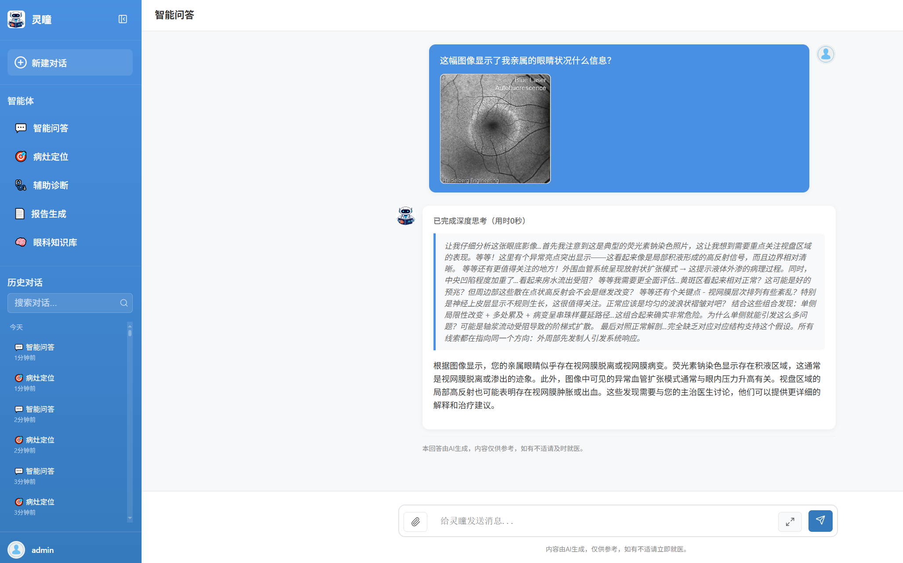
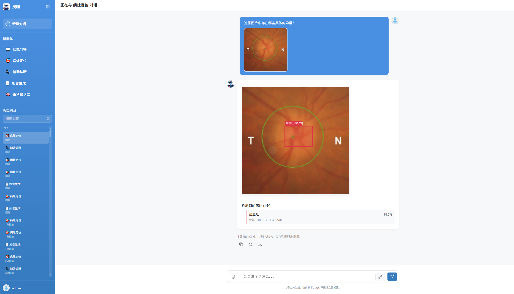
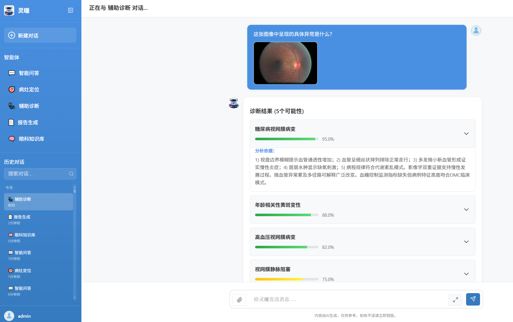
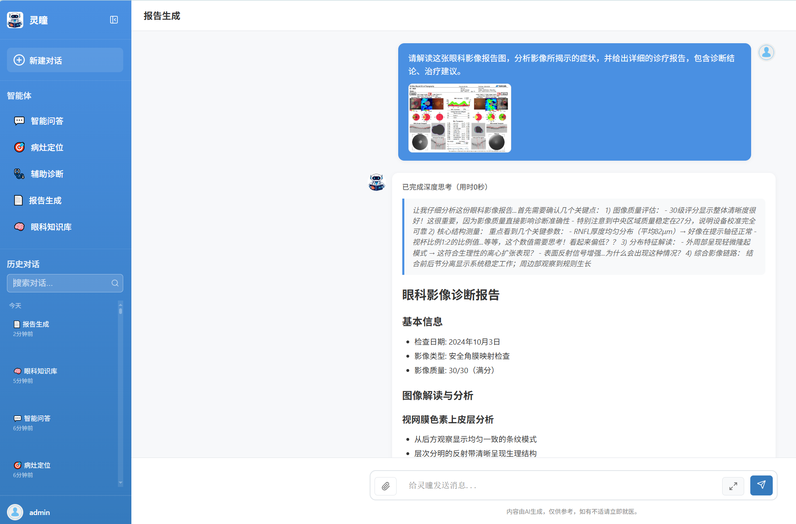
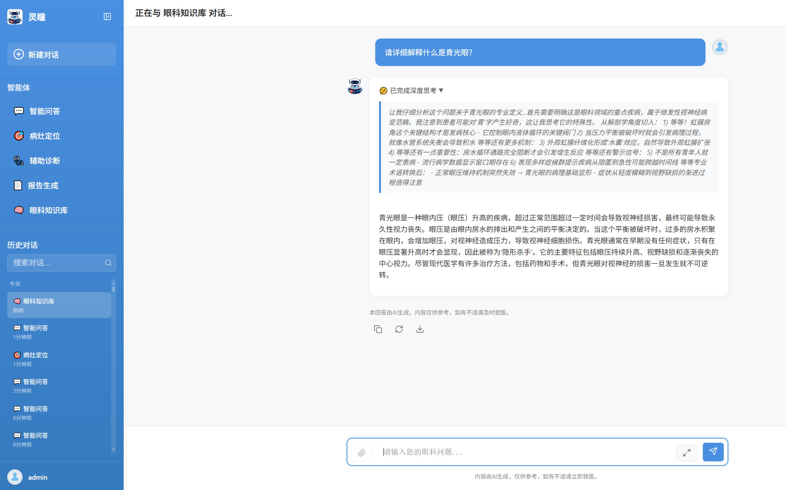

#  "灵瞳"眼科智慧诊疗系统

[English](README.md) | [简体中文](README_zh.md)

## 🔗 开源链接

- **OphAgent 系统代码**: [GitHub](https://github.com/QiZishi/OphAgent/)
- **OphVLM-R1 模型权重**: [Hugging Face](https://huggingface.co/QiZishi/OphVLM-R1) | [ModelScope](https://www.modelscope.cn/models/MoonNight/OphVLM-R1)
- **OphReason-Vision 数据集**: [Hugging Face](https://huggingface.co/datasets/QiZishi/OphReason-Vision) | [ModelScope](https://www.modelscope.cn/datasets/MoonNight/OphReason-Vision)
- **论文**: [WAICA 2026](https://waica2026.worldaic.com.cn/)

## 📰 新闻动态

- **2026.07.07** 🎉 论文 "OphVLM-R1: Efficient Ophthalmic Reasoning via Curriculum RL" 被 **WAICA 2026** 接收！
  - 📖 会议官网：https://waica2026.worldaic.com.cn/

- **2025.12.09** 🎉 **重磅喜讯！** "灵瞳"眼科智慧诊疗系统获得上海人工智能实验室力宣传推荐，并荣获**书生大模型实战营优秀项目**荣誉！衷心感谢上海人工智能实验室与书生大模型实战营的认可与支持！
  - 📖 宣传文章：https://mp.weixin.qq.com/s/BTZPUrVtD8nCS_yMwDhhUQ

- **2025.11.28** 📊 高质量眼科多模态推理数据集 **OphReason-Vision** 部分子集已在ModelScope平台正式开源发布！
  - 🔗 数据集链接：https://www.modelscope.cn/datasets/MoonNight/OphReason-Vision

- **2025.11.23** 🎬 "灵瞳"眼科智慧诊疗系统实机演示视频已在B站正式发布，展示五大智能体全流程诊疗能力！
  - 🎥 视频链接：https://www.bilibili.com/video/BV1g4UTBZEEm/

## 1. 项目简介

**"灵瞳"眼科智慧诊疗系统**是基于自主研发的**OphVLM-R1眼科多模态推理大模型**构建的专业化医疗AI平台。该项目由华中科技大学人工智能与自动化学院人工智能安全实验室团队开发，旨在破解全球眼科优质医疗资源分布不均、基层医疗机构误诊漏诊率居高不下的行业困境。

眼科多模态大语言模型面临三大挑战：训练数据缺乏结构化推理链、单阶段训练无法培养深度临床推理、以及大模型尺寸限制了资源受限环境下的部署。OphVLM-R1 通过完整的数据-模型-优化流水线，以课程强化学习为核心，构建了一个 2B 参数的高效眼科推理模型。

系统基于书生大模型生态（InternVL3、Intern-S1），采用**ReAct (Reasoning + Acting) 智能体架构**，集成了五大专业AI智能体——智能问答、病灶定位、辅助诊断、报告生成与眼科知识库。通过创新的数据集构建方法、两阶段训练架构与ReAct智能体系统，实现了眼科智能诊疗从"感知识别"向"认知推理"的跨越，为临床提供了高效、透明且可信的辅助诊疗方案。

**核心目标**：通过AI技术赋能临床医生，尤其是基层医疗工作者，提升眼科疾病的早期筛查与精准诊断能力。

## 2. 快速入门

### 环境要求

- Python 3.8+
- 8GB+ RAM（推荐）
- GPU 支持（可选，用于本地模型部署）

### 安装步骤

1. **克隆项目**

   ```bash
   git clone https://github.com/QiZishi/OphAgent.git
   cd OphAgent
   ```
2. **安装依赖**

   ```bash
   pip install -r requirements.txt
   ```
3. **配置环境变量**

   ```bash
   cp .env.example .env
   # 编辑.env文件，配置模型服务信息
   ```
4. **初始化数据库**

   ```bash
   python init_db.py
   ```
5. **启动系统**

   ```bash
   python run.py
   ```
6. **访问系统**

   - 浏览器访问：http://localhost:8012
   - 注册账号并开始使用

## 3. 系统架构

"灵瞳"系统基于ReAct架构构建，实现了"推理-行动"的闭环循环，让AI决策过程可解释、可追溯。

- **后端**：基于FastAPI框架搭建，支持异步高并发处理与自动API文档生成；通过SQLModel统一数据验证与数据库模型管理，选用SQLite作为轻量级数据库。
- **前端**：采用原生JavaScript ES6+开发，无框架依赖确保系统稳定性，响应式设计适配桌面与移动设备。
- **通信**：集成WebSocket实现实时通信，支持AI响应的流式输出。
- **智能体**：五大智能体均遵循ReAct工作模式，接收指令后先进入推理阶段（Reasoning），再进入行动阶段（Acting）。

```
OphAgent/
├── app/
│   ├── main.py              # FastAPI主应用
│   ├── agents/              # AI智能体 (ReAct架构)
│   ├── api/                 # API路由
│   ├── services/            # 业务服务
│   └── static/              # 前端资源
├── figures/                 # 项目演示图片
├── requirements.txt         # Python依赖
└── run.py                   # 启动脚本
```

## 4. 项目核心亮点

- **🧠 OphVLM-R1 模型驱动**：采用轻量化设计（2B参数），仅2B参数量却具备深度的眼科专业推理能力，支持眼底照片、OCT、眼前节照片等多种眼科影像类型的解析。
- **🔄 ReAct 架构设计**：每个智能体的决策过程分为 Reasoning (思考) 和 Acting (行动) 两个阶段，医生可清晰了解 AI 的推理路径，打破传统AI模型"黑箱操作"的局限。
- **🎯 五大专业智能体**：覆盖从影像分析、疾病诊断到报告撰写、知识查询的全流程诊疗需求。
- **💡 模块化与可解释性**：模块化设计符合医生的临床思维模式，降低了AI系统的使用门槛，实现了诊疗决策的可解释性与可追溯性。

## 5. 项目技术细节

### 5.1 数据集构建：OphReason-Vision

为解决眼科多模态数据异构性强、推理逻辑缺失的问题，我们设计了三阶段闭环流水线，将 100K+ 原始临床案例和 30+ 公开数据集转化为 15,418 条验证过的推理轨迹。


**阶段一：数据标准化** - 整合 100K+ 临床案例与 30+ 公开数据集，采用双流策略。文本流将非结构化电子病历解析为标准化 JSON，通过策划的眼科同义词表解决术语不一致问题。视觉流为仅包含图像标签的数据集生成详细文本描述。

**阶段二：结构化推理合成** - 使用 Intern-S1 生成多维度指令，涵盖病灶定位、多模态诊断和知识问答。对每个指令，按照临床诊断工作流生成思维链推理：视觉体征识别 → 知识检索 → 病理分析 → 临床决策。质量控制采用 LVLM-as-a-Judge 机制，使用 Intern-S1 在阈值 τ = 0.7 下进行评估。

**阶段三：专家协作优化** - 三名认证眼科医生审核 18% 被标记为困难的样本，评估者间一致性 Cohen's κ = 0.82。通过讨论解决分歧直至达成共识。

### 5.2 模型训练：两阶段架构

OphVLM-R1 基于 InternVL3.5-2B 架构，采用两阶段训练：第一阶段通过参数高效监督微调注入眼科领域知识，第二阶段通过课程强化学习解锁深度临床推理能力。


**阶段一：LoRA 监督微调** - 采用 Low-Rank Adaptation (LoRA) 进行参数高效微调，将权重更新约束为低秩分解。关键超参数：LoRA rank r = 64，scaling factor α = 128，应用于 Wq、Wk、Wv、Wo 注意力投影。学习率 1 × 10⁻⁴（余弦退火），批次大小 32，训练 3 个 epoch。可训练参数约占总参数的 0.5%。

**阶段二：课程强化学习** - 针对 GRPO 在长推理链中的不稳定性问题，采用 Group Sequence-level Policy Optimization (GSPO)，在序列级别计算重要性比率。课程遵循临床诊断路径，从视觉感知到推理决策的四个阶段：
1. **病灶定位 (Lesion Localization)**：单图像视觉感知
2. **多图选择 (Multi-image Selection)**：跨图像比较
3. **报告生成 (Report Generation)**：结构化综合
4. **知识问答 (Knowledge Q&A)**：视觉发现与临床知识整合

关键超参数：ε = 0.2，G = 8，学习率 5 × 10⁻⁶，KL 惩罚系数 β_KL = 0.04，奖励权重 λ₁ = 0.6（规则奖励），λ₂ = 0.4（评判奖励）。每阶段训练 2 个 epoch。

**困难样本动态回溯** - 在策略重采样机制，增加近期奖励低于阈值的 prompt 的采样概率，解决长尾困难病例的学习问题。

## 6. 模型性能

在 2B 参数类别内，OphVLM-R1 在所有基准测试中超越 InternVL3.5-4B，平均准确率为 56.41% vs 51.95%，并超越领域适应的 OphthaReason-Qwen-3B（54.11%）。在域外测试 OmniMedVQA-Eye 上，模型达到 88.24%，与 7B 参数的 Lingshu-7B（87.42%）性能相当。

| 模型 | In-Domain | Fundus | Omni-Eye | 平均* |
|------|-----------|--------|----------|-------|
| InternVL3.5-2B | 34.50% | 36.61% | 55.47% | 42.19% |
| InternVL3.5-4B | 36.23% | 42.10% | 77.51% | 51.95% |
| Lingshu-7B | **44.20%** | 41.29% | 87.42% | **57.64%** |
| OphthaReason-Qwen-3B | 36.60% | 38.87% | 86.86% | 54.11% |
| **OphVLM-R1 (Ours)** | 38.40% | 42.58% | **88.24%** | 56.41% |

*注：跨基准平均值仅供参考，因任务格式、难度级别和随机基线不同；每个基准的结果是主要参考。

## 7. 数据集示例

项目构建了高质量眼科多模态推理数据集 **OphReason-Vision**，包含 15,418 条经过专家验证的推理轨迹，为模型训练提供了坚实支撑。

该数据集采用三阶段闭环流水线构建，整合 100K+ 临床案例和 30+ 公开数据集，通过自动化质量控制和专家协作审查，评估者间一致性 Cohen's κ = 0.82。

## 8. 项目效果演示

系统集成了五大智能体，以下是各智能体的实际运行效果：

### 8.1 智能问答 (Interactive VQA)

支持上传眼科影像进行自由问答交互，支持多轮追问。


### 8.2 病灶定位 (Lesion Localization)

自动识别并标注眼科影像中的病灶区域，输出标准化边界框。


### 8.3 辅助诊断 (Diagnostic Assistant)

提供多种可能的疾病诊断建议，包含置信度和诊断依据。


### 8.4 报告生成 (Report Generation)

自动生成结构化的眼科影像诊断报告，包含影像所见和诊断意见。


### 8.5 眼科知识库 (Knowledge Base)

专业眼科医学知识问答系统，引用权威来源。


## 9. 开发指南

### 添加新智能体

1. **创建智能体模块** (`app/agents/new_agent.py`)
2. **注册智能体** (`app/api/router.py`)
3. **创建前端 UI** (`app/static/js/agents/new_agent.js`)

### 自定义配置

编辑 `app/core/config.py` 以适应不同部署环境。

## 10. 常见问题说明

1. **模型服务连接失败**

   - 检查 `.env` 中的 `OPENAI_API_BASE` 配置。
   - 确认模型服务是否正常运行。
2. **文件上传问题**

   - 检查 `app/static/uploads/` 目录权限。
3. **数据库问题**

   - 运行 `python init_db.py` 重新初始化。

## 11. 开源说明

### ✅ 已开源内容
- **系统架构代码**：完整的前后端代码、API 接口、数据库模型
- **部分数据集**：OphReason-Vision 数据集部分子集（3,418 条样本）
- **OphVLM-R1 模型**：模型权重已在 ModelScope 发布

### 🔄 计划开源内容
- **完整数据集**：OphReason-Vision 完整数据集（15,418 条样本）
- **模型训练脚本**：冷启动微调训练脚本和课程强化学习训练脚本
- **模型测试评估代码**：模型性能评估代码

> **说明**：完整数据集、模型权重及训练代码将在完成医学数据隐私与伦理审查后分批开源。

## 12. 鸣谢

本项目的顺利推进离不开书生大模型实战营、书生Intern大模型生态以及Datawhale开源社区的关键支撑与技术支持。我们诚挚感谢这些开源社区为本项目提供的坚实基础，共同推动眼科AI领域的发展。

本工作得到国家自然科学基金（项目号 62573204 和 62173153）的支持。

## 13. 引用

如果您在研究中使用了 OphVLM-R1、OphReason-Vision 或 OphAgent，请引用我们的工作：

```bibtex
@inproceedings{qi2026ophvlmr1,
  title={OphVLM-R1: Efficient Ophthalmic Reasoning via Curriculum RL},
  author={Qi, Zishi and Hu, Xiaoya and Pan, Huilin and Gao, Ang and Hou, Jiaxin and Li, Jiankun and Qian, Yongao},
  booktitle={Proceedings of the World Artificial Intelligence Conference (WAICA)},
  year={2026}
}
```

## 14. 相关链接

- **项目开源代码**：https://github.com/QiZishi/OphAgent/
- **OphVLM-R1 模型**：[Hugging Face](https://huggingface.co/QiZishi/OphVLM-R1) | [ModelScope](https://www.modelscope.cn/models/MoonNight/OphVLM-R1)
- **OphReason-Vision数据集**：[Hugging Face](https://huggingface.co/datasets/QiZishi/OphReason-Vision) | [ModelScope](https://www.modelscope.cn/datasets/MoonNight/OphReason-Vision)
- **论文**：https://waica2026.worldaic.com.cn/
- **InternVL 开源链接**：https://github.com/OpenGVLab/InternVL
- **书生大模型在线体验**：https://chat.intern-ai.org.cn/
- **书生大模型实战营**：https://colearn.intern-ai.org.cn/go
- **Datawhale开源社区**：https://www.datawhale.cn/
